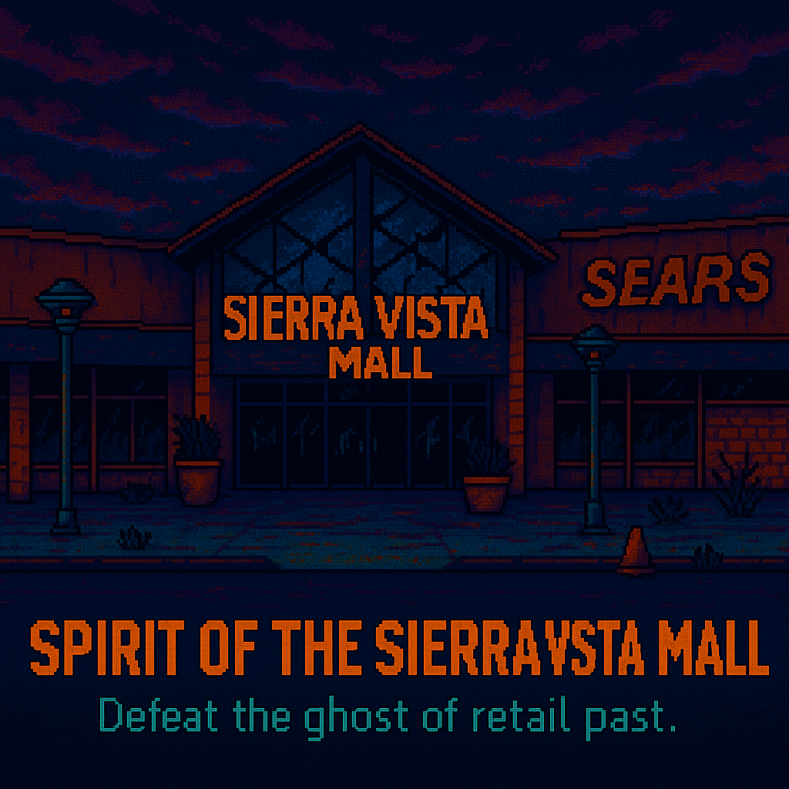
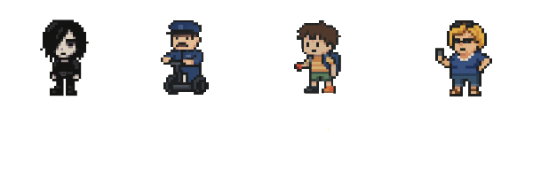
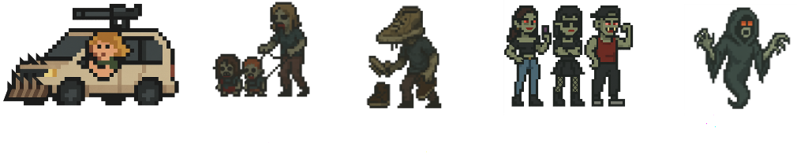

# 👻Spirit of The Sierra Vista Mall👻 

### Ella Siadto - Person A - Inheritor of Suffer  
Hello ~ I dont often play video games, but I am pretty familiar with RPG themes. I'm really excited about this project and I look foward to seeing where our ideas lead us. 
    
### Tess Talbot – Person B - The BRIDGEngineer 🛠️🚧
Really excited for this project! I have very little gaming experince other than Minecraft but hope to make something fun!

### Rajnoor - Hello, Role Person C. 

# 🛍️ **SPIRIT OF THE SIERRA VISTA MALL**  
*Technically open, spiritually in hospice.*

---

### 👥 Assemble your cursed crew:

- 🦇 A mall **Goth**
- 👮 A Segway **Cop**
- 🧃 A feral **Unattended Child**
- 💅 And of course, **Karen**

---

### ☠️ Face off against:

- 🚐 **Minivan Mom**
- 🧒 **Leashed Kids**
- 👟 **Sneaker Head**
- 🧛‍♀️ The **Never 21 Vampires**

---

### 🧿 Deep in the ruins of *Sears*, something ancient stirs...

**THE SPIRIT** of suburban consumerism —  
Born from clearance racks, broken escalators,  
and dreams of a better **Bath & Body Works**.

---

### 🎯 *Defeat the Spirit.*  
Or get trapped in the mall… **forever on sale.**

